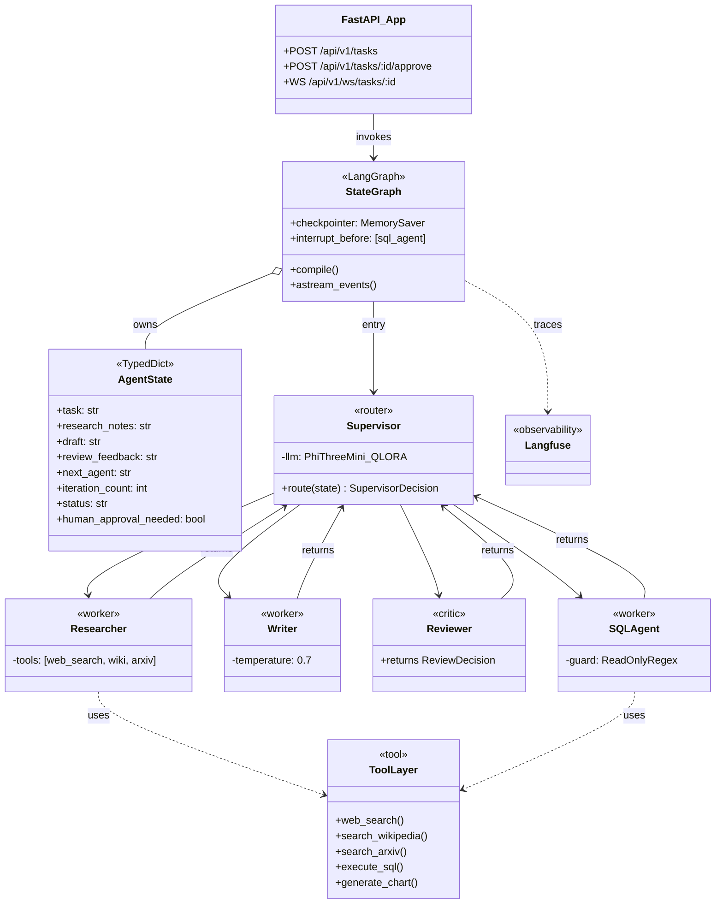
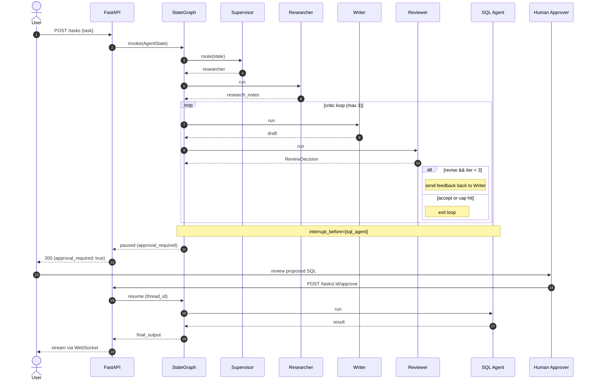

# AgentForge 🤖

> A production-grade multi-agent AI platform where specialized LLM agents collaborate to research, write, review, and query.

[](https://www.python.org/)
[](https://fastapi.tiangolo.com/)
[](https://github.com/langchain-ai/langgraph)
[](https://opensource.org/licenses/MIT)

---

## What is AgentForge?

AgentForge is an open-source agentic AI system. Instead of asking one LLM to do everything, AgentForge spins up a team of specialized agents — a Researcher, a Writer, a Reviewer, and a SQL Agent — coordinated by a Supervisor that decides who does what next.

Think of it like a small newsroom inside your API:

- The Researcher searches the web, Wikipedia, and arXiv
- The Writer drafts content from the research
- The Reviewer scores the draft and sends it back for revision if it isn't good enough
- The SQL Agent answers data questions (with a human approval step before running queries)
- The Supervisor is a small fine-tuned model that routes work between them

You send one request. You watch the agents work live over WebSocket. You get a polished answer back.

---

## Why Does This Exist?

Most "agent" demos are toy scripts that break in production. AgentForge is built to show what the real patterns look like.

| Problem | How AgentForge Solves It |
|---|---|
| Agents loop forever and burn tokens | Bounded Reflexion critic loop (max 3 iterations) |
| Agents do dangerous things autonomously | Human-in-the-loop approval before SQL execution |
| Big router LLMs are slow and expensive | QLoRA fine-tuned Phi-3-mini router — 12× cheaper, 6× faster |
| Hard to debug what an agent did | Live WebSocket trajectory + Langfuse traces |
| One framework lock-in | Same workflow implemented in LangGraph and CrewAI for comparison |

---

## Architecture

### Component Diagram (UML)

----- 

---

## Features

- Multi-agent graph — LangGraph StateGraph with TypedDict state, conditional edges, and cycles
- Specialized agents — Researcher (web/wiki/arXiv), Writer (creative), Reviewer (structured output), SQL Agent (read-only)
- Self-correction — Writer → Reviewer Reflexion loop, capped at 3 iterations
- Human-in-the-loop — interrupt_before + checkpointer; users approve dangerous actions via REST
- Live progress — every agent step streamed to the browser over WebSocket
- Safe tools — typed @tool functions with Pydantic arg schemas; SQL guarded by read-only regex
- Fine-tuned router — QLoRA Phi-3-mini replacing the heavy routing LLM (~12× cheaper)
- Observability — Langfuse traces every node, tool call, and LLM invocation
- Framework comparison — same workflow built in CrewAI for side-by-side learning
- Tested + evaluated — pytest suite + 30-task trajectory/outcome golden set

---

## Quick Start

### Prerequisites

- Python 3.11
- Docker *(optional, for Langfuse)*
- A free [Groq API key](https://console.groq.com/) and [Tavily API key](https://tavily.com/)

### Setup

# Clone
git clone https://github.com/<your-user>/AgentForge.git
cd AgentForge

# Virtual environment
python -m venv .venv
.\.venv\Scripts\Activate.ps1   # Windows PowerShell
# source .venv/bin/activate    # macOS / Linux

# Dependencies
pip install -r requirements.txt

# Secrets
cp .env.example .env
# add GROQ_API_KEY, TAVILY_API_KEY, LANGFUSE_* (optional)

# Run
uvicorn app.main:app --reload
API docs: http://localhost:8000/docs

### Try It

curl -X POST http://localhost:8000/api/v1/tasks \
  -H "Content-Type: application/json" \
  -d '{"task": "Research recent advances in RAG and write a 200-word summary."}'
### Watch Agents Work Live

Open demo/ws_demo.html and submit a task — you'll see each agent step in real time:

[Supervisor] -> researcher
[Researcher] tool: web_search
[Researcher] tool: search_arxiv
[Supervisor] -> writer
[Writer] draft ready
[Supervisor] -> reviewer
[Reviewer] decision=revise score=6
[Supervisor] -> writer
[Reviewer] decision=accept score=9
[Supervisor] -> done
---

## Project Structure

```
AgentForge/
├── app/
│   ├── main.py                  # FastAPI entry point
│   ├── api/routes/
│   │   ├── tasks.py
│   │   └── websocket.py
│   ├── agents/
│   │   ├── state.py
│   │   ├── nodes.py
│   │   └── graph.py
│   ├── tools/                   # @tool functions
│   ├── prompts/                 # System prompts per agent
│   ├── services/
│   │   └── llm.py               # LLM factory (Groq → Ollama fallback)
│   ├── guardrails/              # Input/output safety
│   ├── core/config.py           # 12-factor settings
│   └── models/schemas.py
├── crewai_alternative/
│   └── crew.py                  # Same workflow in CrewAI
├── finetune/                    # QLoRA dataset + Colab notebook
├── evals/                       # Golden sets + scoring scripts
├── demo/
│   └── ws_demo.html             # Browser WebSocket demo
├── tests/                       # pytest suite
├── requirements.txt
└── README.md
```

---

## Tech Stack

| Layer | Tool |
|---|---|
| Orchestration | LangGraph 1.1 |
| Chains / Tools | LangChain 1.2 |
| API | FastAPI + Uvicorn |
| LLM (prod) | Groq (Llama 3.1 70B) |
| LLM (fallback) | Ollama (Llama 3.1 8B, Phi-3-mini) |
| Validation | Pydantic 2.9 |
| Search | Tavily, DuckDuckGo, Wikipedia, arXiv |
| Database | SQLAlchemy + SQLite |
| Fine-tuning | Unsloth + PEFT + TRL (QLoRA, 4-bit) |
| Observability | Langfuse |
| Alt. framework | CrewAI |
| Testing | pytest, pytest-asyncio |

---

## Results

| Metric | Value |
|---|---|
| Router accuracy (Phi-3 zero-shot baseline) | ~78% |
| Router accuracy (QLoRA fine-tuned) | 94% |
| Router latency (Phi-3 local) | ~80 ms |
| Router latency (GPT-4o-mini) | ~500 ms |
| Cost per 1k routing decisions (local vs GPT-4o-mini) | $0 vs $0.05 |
| Quality lift from critic loop (round 1) | +18% |

---

## Contributing

This is a learning/portfolio project, but issues and PRs are welcome. If you spot a bug, want a new agent, or have a better routing idea — open an issue.

---

## License

[MIT](LICENSE) — free to use, modify, and learn from.

---

## Acknowledgements

Built on top of the excellent work by the [LangChain](https://github.com/langchain-ai/langchain), [LangGraph](https://github.com/langchain-ai/langgraph), [CrewAI](https://github.com/crewATInc/crewAI), and [Unsloth](https://github.com/unslothai/unsloth) teams.
